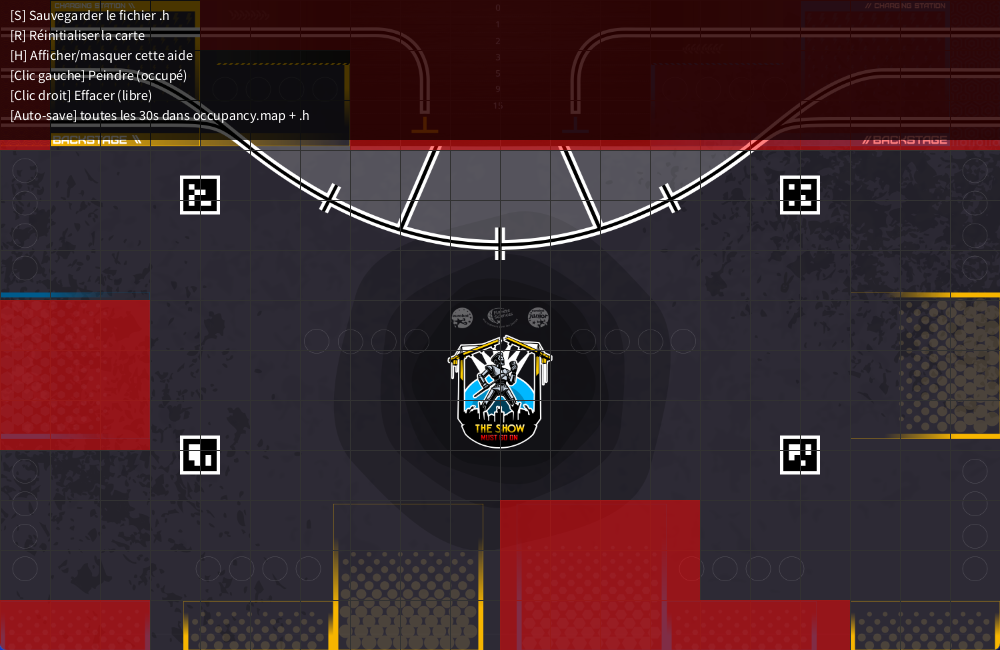

# Occupancy Map Editor - Eurobot 2025



## 🎯 Objectif

Ce projet Processing permet de créer, éditer et exporter une **carte d'occupation** (occupancy map) utilisée pour la navigation de robots sur une table Eurobot (3m x 2m). L'utilisateur peut peindre des zones occupées, sauvegarder la carte sous forme de tableau C++, et recharger ou réinitialiser facilement la carte.

---

## ✨ Fonctionnalités

- Peinture manuelle des cellules occupées ou libres
- Image de fond du terrain semi-transparente
- Quadrillage configurable (échelle des cases)
- Sauvegarde automatique toutes les X secondes (.map + .h)
- Export manuel de la carte au format `.h` via une fenêtre
- Réinitialisation complète de la carte
- Affichage d'une aide avec les raccourcis clavier
- Notification visuelle lors des sauvegardes

---

## ⌨️ Raccourcis clavier

| Touche | Action                                 |
|--------|----------------------------------------|
| **S**  | Sauvegarder manuellement le fichier `.h` |
| **R**  | Réinitialiser la carte (tout à zéro)   |
| **H**  | Afficher/masquer le panneau d'aide     |
| clic gauche | Peindre une cellule (occupée)     |
| clic droit  | Effacer une cellule (libre)       |

---

## 💾 Fichiers générés

- `occupancy.map` — fichier simple avec des 0 et 1, lisible pour recharger dans Processing
- `occupancy_map.h` — tableau C++ utilisable dans vos projets de robotique

---

## 🖼️ Image de fond

L’image `terrain.png` (à placer dans le dossier `data/`) est redimensionnée automatiquement pour s’adapter à la taille de la fenêtre.

---

## ✅ À faire

- [ ] Ajouter le support de plusieurs types de cellules (zones interdites, adversaires, etc.)
- [ ] Ajouter zoom et défilement
- [ ] Interface graphique avec boutons et couleurs sélectionnables

---

## 📁 Structure du projet

```
OccupancyMapEditor/
├── OccupancyMapEditor.pde
├── occupancy.map
├── occupancy_map.h
├── OccupancyMapEditor.png
└── data/
    └── terrain2025.png
```

---

## 🚀 Lancer le projet

1. Ouvrir `OccupancyMapEditor.pde` dans Processing
2. S’assurer que `terrain2025.png` est présent dans le dossier `data/`
3. Lancer (`Ctrl + R`) et commencer à peindre !

---

Développé pour les besoins du projet **Les Karibous - Coupe de France de Robotique 2025** 🤖
